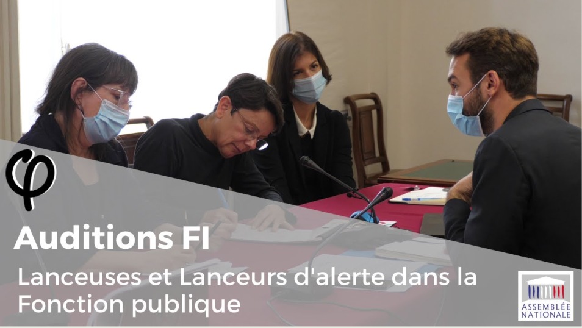

# Audition sur les lanceurs d'alerte dans la fonction publique #
### Information ###
[Cette audition](https://www.facebook.com/ugobernalicis/videos/audition-%CF%86-lanceurs-dalerte-dans-la-fonction-publique-14-octobre-2020/2815635448757703/) a eu lieu le 14 octobre 2020 à l'instigation du député Ugo Bernalicis
### Intervenants ###
* [Ugo Bernalicis](https://www.facebook.com/ugobernalicis), hôte et modérateur
* Maître Mazza, avocat spécialisé dans la fonction publique
* [Françoise Nicolas](https://github.com/francoise-nicolas), ex-agent du [ministère des affaires étrangères](https://www.diplomatie.gouv.fr/fr/) 
* Jocelyne Chassard, ex-enseignante du second degré 
### Verbatim ###
J'ai proposé un [verbatim](verbatim.md) de l'audition, soumis à des [droits d'auteur](LICENSE.md). J'ai fait quelques retouches, minimes et consultables dans le [fichier source](verbatim.md?plain=1).

